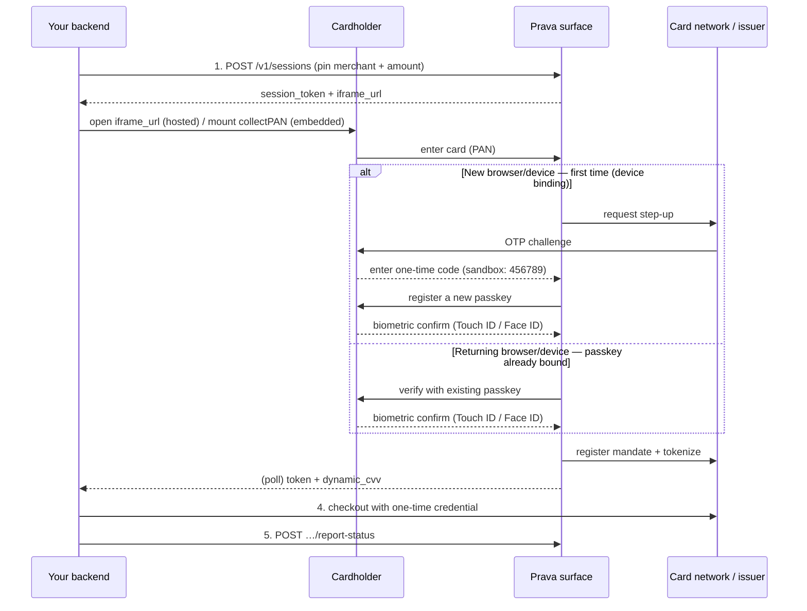

> ## Documentation Index
> Fetch the complete documentation index at: https://docs.prava.space/llms.txt
> Use this file to discover all available pages before exploring further.

# Anatomy of a Checkout

> The full sequence behind a single payment — including the card-verification steps (passkey / device binding and issuer OTP) that a first-time integrator does not see coming.

From your side a payment is [three API calls and one hand-off](/concepts/payments#the-lifecycle-you-drive).
This page zooms into the hand-off — **step 2, card entry** — because that's where the human-facing
verification happens, and those steps aren't visible in the API surface. If you're budgeting time for
a demo, read this so nothing surprises you.

## The full sequence

## The verification steps (step 2, expanded)

What the cardholder sees between "enter card" and "credential issued" depends on whether **this
browser/device has been used with this card before**. A passkey (WebAuthn / FIDO — Touch ID, Face ID)
is always the final gate; the one-time OTP only appears the first time.

<Info>
  Passkey registration and verification happen on **Card Network's own hosted page**. The cardholder authenticates with Card Network directly;
  neither you nor Prava render that page. Expect the hand-off — seeing Card Network's domain is what makes
  the approval verifiable rather than claimed.
</Info>

**Returning browser/device.** A passkey is already bound to this browser for this card, so the
cardholder just **verifies with the existing passkey** — one biometric prompt, no OTP. This is the
common case on repeat purchases.

**New browser/device — first time (device binding).** There's no passkey on this browser yet, so
Prava **binds the device**. Two steps, **in this order**:

<Steps>
  <Step title="1. Issuer OTP (first)">
    The card issuer sends a **one-time code** — the same 3-D Secure style step-up your bank does when it
    texts you a code. The cardholder enters it before anything else.

    <Note>
      **In sandbox**, enter the test code **`456789`** with any [test card](/api-reference/test-cards).
      Real codes only exist in production.
    </Note>
  </Step>

  <Step title="2. Passkey registration (only after the OTP validates)">
    Once the OTP checks out, Prava **registers a new passkey** (biometric — Touch ID / Face ID), bound
    to this browser/device. The signed passkey is what proves the cardholder approved *this* transaction.
  </Step>
</Steps>

Passkeys are **bound per browser/device**, so the same cardholder on a new browser or device repeats
device binding (OTP → new passkey) — that's the "device binding" referenced in
[Guardrails](/concepts/guardrails): a security property, not a bug. For where issuer step-up sits in
the regulatory picture, see [Compliance](/guides/compliance).

After verification succeeds, Prava registers a [mandate](/concepts/mandates) with the network and
[tokenizes](/concepts/payments) the card into the one-time credential you receive in step 3. None of
that needs an API call from you.

## What you see from your side

You never call anything during verification — you just poll
[Get Payment Result](/api-reference/get-payment-result). The
[transaction status](/concepts/payments#transactions) walks:

| Status                 | What the cardholder is doing                                                                                   |
| ---------------------- | -------------------------------------------------------------------------------------------------------------- |
| `pending`              | Hasn't opened the surface / started card entry yet                                                             |
| `processing`           | Entering card, verifying or registering a passkey (plus a one-time OTP on a new device); credentials not ready |
| `awaiting_result`      | Verified — credentials issued, checkout in progress                                                            |
| `completed` / `failed` | Outcome reported back via [Report Status](/api-reference/report-status)                                        |

If `payment-result` sits at `pending` forever, the cardholder simply hasn't finished this sequence —
see the [Developer FAQ](/developer-faq).

## Next

<CardGroup cols={2}>
  <Card title="Payments concept" icon="money-bill" href="/concepts/payments">
    Mandates, tokens, and the money-side machinery in full.
  </Card>

  <Card title="Test cards & test OTP" icon="credit-card" href="/api-reference/test-cards">
    The card numbers and the `456789` OTP to run the whole thing in sandbox.
  </Card>
</CardGroup>
