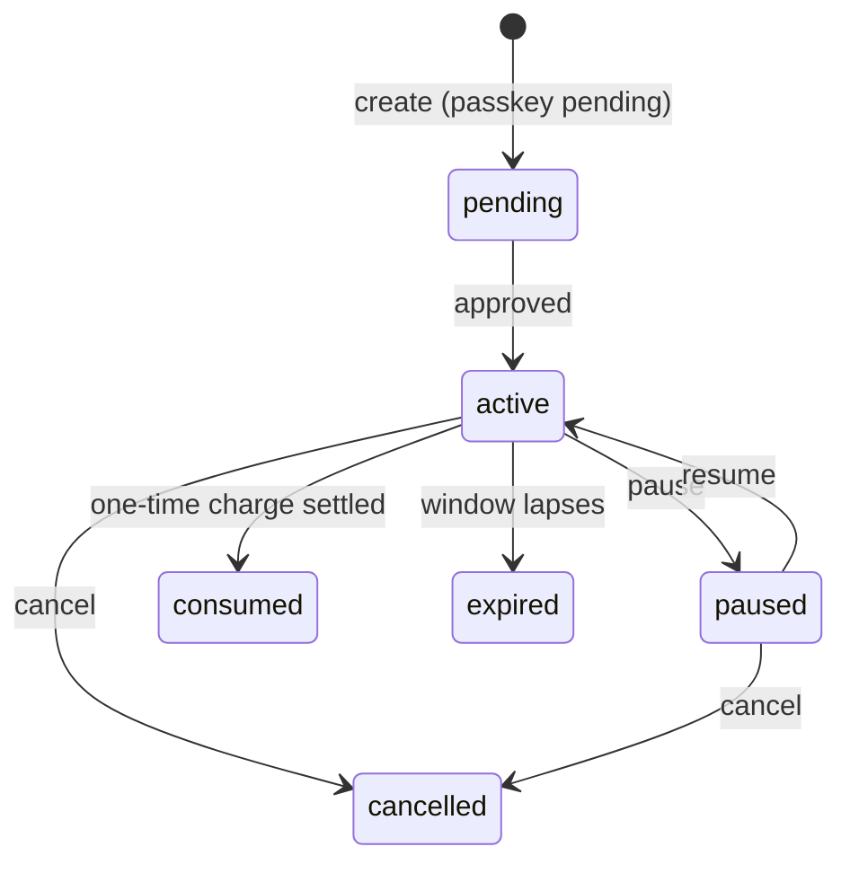

> ## Documentation Index
> Fetch the complete documentation index at: https://docs.prava.space/llms.txt
> Use this file to discover all available pages before exploring further.

# Mandates

> Standing spend authorizations — approve once with a passkey, let an agent charge later within caps.

A **mandate** is a standing spending authorization. The owner approves it **once**
with a passkey; afterwards an agent can charge that card **again and again within
caps, without re-approval**. It is the "authorize now, charge later" counterpart to
a one-shot [payment session](/prava-pay/sessions).

Reach for a mandate when spend repeats or is deferred — a monthly budget at one
merchant, a "buy it when it's back in stock" instruction, an agent that pays
several times against a fixed allowance. For a single known purchase, a
[payment session](/prava-pay/sessions) is simpler.

## Setup vs. charge

A mandate has two phases, and only the first involves the human.

**Setup (once, with a passkey).** A mandate is created through a payment
**session** carrying a `mandate_setup` block — there is no standalone create
endpoint. Over REST, that's
[Create Session → Mandate setup](/api-reference/create-session#mandate-setup).
The response is an approval URL; the owner opens it and confirms with
their passkey. That single approval is the standing consent.

**Charge (later, no passkey).** Against an active mandate, an agent mints fresh
[single-use credentials](/concepts/payments) with **no** new passkey — as many
times as the caps allow. Charging is available
through the [CLI](/prava-pay/mandates#prava-mandate-charge) and the
[REST API](/api-reference/mandate-charge); it is deliberately **not** exposed over MCP.

<Note>
  The passkey approval at setup is the only human-in-the-loop step. Every later
  charge is authorized by that original approval, bounded by the caps below.
</Note>

## Lifecycle

A mandate moves through these statuses:

| Status      | Meaning                                                                 |
| ----------- | ----------------------------------------------------------------------- |
| `pending`   | Created; awaiting the owner's passkey approval and network confirmation |
| `active`    | Live and chargeable                                                     |
| `paused`    | Temporarily suspended by the owner; no charges until resumed            |
| `consumed`  | A one-time mandate whose single charge has settled                      |
| `cancelled` | Revoked (by owner or agent); terminal                                   |
| `expired`   | Past its validity window                                                |

Recurring mandates stay `active` across cycles; a one-time mandate becomes
`consumed` after its charge settles. Illegal transitions (e.g. resuming a
cancelled mandate) are refused with `409 MANDATE_INVALID_TRANSITION`.

## Guardrails

A mandate is itself a guardrail. Every charge is bounded by:

| Guardrail           | What it controls                                                                                                                                                                 |
| ------------------- | -------------------------------------------------------------------------------------------------------------------------------------------------------------------------------- |
| **Amount cap**      | Maximum per charge. Enforced at the card-network level through the tokenized credential — an over-cap charge is declined.                                                        |
| **Merchant scope**  | `listed` locks the mandate to one named merchant; `any` allows any merchant (one-time only). A charge at a non-allowed merchant is refused (`403 MANDATE_MERCHANT_NOT_ALLOWED`). |
| **Frequency**       | `one_time`, or recurring `weekly` / `monthly` / `yearly` — one charge per cycle, always locked to a single merchant.                                                             |
| **Validity window** | One-time mandates are valid up to **7 days**; recurring mandates run for a multi-cycle horizon.                                                                                  |

Recurring *frequencies* are available today: approve once, and the agent charges
within caps each cycle without a fresh passkey. **Scheduled subscriptions** — where
Prava auto-charges on the cycle — are coming next; for now the agent still initiates
each charge within the cycle.

This sits inside Prava's [layered guardrails](/concepts/guardrails): owner account
controls, then the passkey approval, then the mandate's own caps, then the
single-use credential each charge produces.

## Where each surface fits

| Surface       | Use it to                                                                 | Reference                                                                                                           |
| ------------- | ------------------------------------------------------------------------- | ------------------------------------------------------------------------------------------------------------------- |
| **CLI**       | Set up, charge, and settle mandates from an agent                         | [Mandates (CLI)](/prava-pay/mandates)                                                                               |
| **MCP**       | Create, list, and manage mandates from an MCP client (no charging)        | [Mandate tools](/mcp/tools#mandates)                                                                                |
| **REST API**  | Create (through session creation), charge, report, and manage server-side | [Create a mandate](/api-reference/create-session#mandate-setup) · [Charge a mandate](/api-reference/mandate-charge) |
| **Dashboard** | View mandates, spend, and charge history; pause / resume / cancel         | [pay.prava.space](https://pay.prava.space)                                                                          |

Over REST, mandate creation is part of the Session APIs — create one through
[Create Session](/api-reference/create-session#mandate-setup) with a
`mandate_setup` block.
