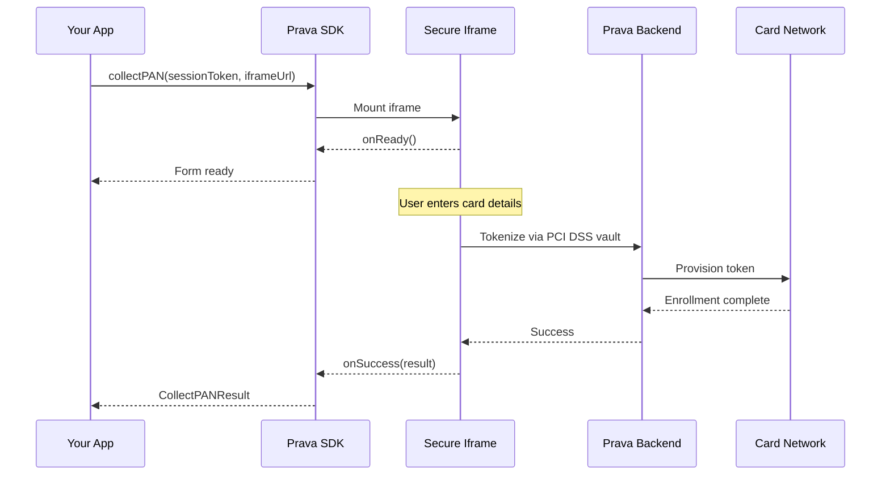

> ## Documentation Index
> Fetch the complete documentation index at: https://docs.prava.space/llms.txt
> Use this file to discover all available pages before exploring further.

# Collect Card Details

> Securely collect and tokenize user payment cards

## Overview

The `collectPAN()` method securely collects credit card details from users through an isolated iframe. The card data is tokenized via Prava's PCI DSS vault and returns only safe metadata — your servers never see the raw PAN.

## Method Signature

```typescript theme={null}
prava.collectPAN(options: CollectPANOptions): Promise<CollectPANResult>
```

## Parameters

<ParamField path="options" type="CollectPANOptions" required>
  Configuration options for card collection

  <Expandable title="properties">
    <ParamField path="sessionToken" type="string" required>
      The `session_token` (JWT) from your backend session response — it authenticates in-session SDK
      calls. Note: the session identifier the iframe loads is already embedded in `iframe_url`
      (`?session=<session_id>`); you never build that URL yourself.
    </ParamField>

    <ParamField path="iframeUrl" type="string" required>
      The `iframe_url` from your backend session response — pass it **verbatim**. It already contains
      the `?session=<session_id>` identifier; do not rebuild it or add your own query params.
    </ParamField>

    <ParamField path="container" type="string | HTMLElement" required>
      CSS selector or DOM element to mount the card form (e.g., `#card-form`)
    </ParamField>

    <ParamField path="onReady" type="() => void">
      Called when the iframe is loaded and ready for input
    </ParamField>

    <ParamField path="onChange" type="(state: CardValidationState) => void">
      Real-time validation state on every keystroke
    </ParamField>

    <ParamField path="onSuccess" type="(result: CollectPANResult) => void">
      Called on successful card enrollment
    </ParamField>

    <ParamField path="onError" type="(error: PravaError) => void">
      Called on error
    </ParamField>

    <ParamField path="onDismiss" type="(payload: { reason: string }) => void">
      Called when the user dismisses the payment flow
    </ParamField>

    <ParamField path="styles" type="CardFormStyles">
      Custom styles for the card form. Supports `base`, `invalid`, and `focus` states as CSS property maps.
    </ParamField>
  </Expandable>
</ParamField>

## Return Value

<ResponseField name="result" type="CollectPANResult">
  <Expandable title="properties">
    <ResponseField name="enrollmentId" type="string">
      Unique identifier for the collected card
    </ResponseField>

    <ResponseField name="last4" type="string">
      Last 4 digits of the card number
    </ResponseField>

    <ResponseField name="brand" type="string">
      Card brand (`visa`, etc.)
    </ResponseField>

    <ResponseField name="expMonth" type="number">
      Card expiration month (1-12)
    </ResponseField>

    <ResponseField name="expYear" type="number">
      Card expiration year (4 digits)
    </ResponseField>
  </Expandable>
</ResponseField>

<Note>
  The `enrollmentId` identifies the collected card on the server side. Use your backend and the
  [API Reference](/api-reference/overview) to read payment results and report status for that card.
</Note>

## Example

<CodeGroup>
  ```typescript React theme={null}
  import { useEffect, useRef, useState } from 'react';
  import { PravaSDK } from '@prava-sdk/core';
  import type { CollectPANResult } from '@prava-sdk/core';

  function CardEnrollment({ session }: { session: { session_token: string; iframe_url: string } }) {
    const containerRef = useRef<HTMLDivElement>(null);
    const sdkRef = useRef<PravaSDK | null>(null);
    const [enrolled, setEnrolled] = useState<CollectPANResult | null>(null);

    useEffect(() => {
      const sdk = new PravaSDK({ publishableKey: 'pk_test_xxx' });
      sdkRef.current = sdk;
      return () => sdk.destroy();
    }, []);

    const handleEnroll = async () => {
      if (!sdkRef.current || !containerRef.current) return;

      const result = await sdkRef.current.collectPAN({
        sessionToken: session.session_token,
        iframeUrl: session.iframe_url,
        container: containerRef.current,
        onReady: () => console.log('Form loaded'),
        onChange: (state) => {
          console.log('Complete:', state.isComplete);
        },
        onSuccess: (data) => {
          console.log(`Enrolled: •••• ${data.last4}`);
          setEnrolled(data);
        },
        onError: (err) => console.error(err.code, err.message),
      });
    };

    return (
      <div>
        <div ref={containerRef} />
        <button onClick={handleEnroll}>Enroll Card</button>
        {enrolled && <p>Card enrolled: {enrolled.brand} •••• {enrolled.last4}</p>}
      </div>
    );
  }
  ```

  ```typescript Vanilla JavaScript theme={null}
  import { PravaSDK } from '@prava-sdk/core';

  const prava = new PravaSDK({ publishableKey: 'pk_test_xxx' });

  // Get session from your backend
  const session = await fetch('/api/session').then(r => r.json());

  // Collect card via secure iframe
  const card = await prava.collectPAN({
    sessionToken: session.session_token,
    iframeUrl: session.iframe_url,
    container: '#card-form',
    onReady: () => console.log('Form loaded'),
    onChange: (state) => {
      document.getElementById('submit-btn').disabled = !state.isComplete;
    },
    onSuccess: (data) => {
      console.log(data.enrollmentId, data.last4, data.brand);
    },
    onError: (err) => console.error(err.code, err.message),
  });
  ```
</CodeGroup>

```html theme={null}
<div id="card-form"></div>
<button id="submit-btn" disabled>Enroll Card</button>
```

## Flow Diagram



## Under the Hood

When you call `collectPAN()`, here's what happens:

<Steps>
  <Step title="Iframe Injection">
    The SDK injects a secure, sandboxed iframe into your specified container. The iframe is served from Prava's domain — card data never touches your DOM or servers.
  </Step>

  <Step title="Session Validation">
    The iframe validates the session token with Prava's backend to ensure the request is legitimate and not expired.
  </Step>

  <Step title="User Input">
    The user enters their card details (number, expiry, CVV) in the iframe form with real-time validation.
  </Step>

  <Step title="PCI DSS Vaulting">
    When the user submits, the iframe tokenizes the PAN via Prava's PCI DSS vault. Your servers never see the raw card number.
  </Step>

  <Step title="Result">
    The enrollment result (with `enrollmentId`, `last4`, `brand`, `expMonth`, `expYear`) is returned to your app.
  </Step>
</Steps>

## Validation States

The `onChange` callback receives a `CardValidationState` object on every keystroke:

```typescript theme={null}
interface CardValidationState {
  cardNumber: FieldState;
  expiry: FieldState;
  cvv: FieldState;
  isComplete: boolean; // true when all fields are valid
}

interface FieldState {
  isEmpty: boolean;
  isValid: boolean;
  isFocused: boolean;
  error?: string;
}
```

Use `isComplete` to enable/disable your submit button:

```typescript theme={null}
onChange: (state) => {
  submitButton.disabled = !state.isComplete;
}
```

## Error Handling

### Common Errors

| Code                          | Cause                                                                                              | Resolution                                                                                                  |
| ----------------------------- | -------------------------------------------------------------------------------------------------- | ----------------------------------------------------------------------------------------------------------- |
| `SDK_ALREADY_ACTIVE`          | `collectPAN` called while another collection is in progress                                        | Call `destroy()` first                                                                                      |
| `INVALID_CONFIG`              | Missing `iframeUrl` (or a bad `publishableKey`)                                                    | Pass the `iframe_url` from your backend session response                                                    |
| `IFRAME_LOAD_ERROR`           | Iframe failed to load                                                                              | Check network, verify `iframeUrl`                                                                           |
| `Session preview failed: 404` | The `?session=` value isn't a valid `session_id` (e.g. the `session_token`/JWT was passed instead) | Pass `iframe_url` verbatim; don't set your own `session`/`session_token` param; verify sandbox vs prod host |
| `SDK_INIT_ERROR`              | SDK initialization failed                                                                          | Verify browser compatibility and config                                                                     |

## Security Notes

<Warning>
  **Never** attempt to bypass the iframe or collect card data directly. The iframe is sandboxed with `allow-scripts allow-same-origin allow-forms allow-popups allow-popups-to-escape-sandbox` and a permissions policy of `payment; publickey-credentials-get; publickey-credentials-create`. Card data never touches your DOM, JS, or servers.
</Warning>

<Note>
  PostMessage communication is origin-locked. The iframe resolves its backend from its own hostname — merchants cannot inject a fake backend URL.
</Note>

## Next Steps

<CardGroup cols={2}>
  <Card title="List Cards (API)" icon="list" href="/api-reference/list-cards">
    Retrieve a customer's enrolled cards server-side
  </Card>

  <Card title="Get Payment Result" icon="receipt" href="/api-reference/get-payment-result">
    Read the outcome after the card is collected
  </Card>
</CardGroup>
